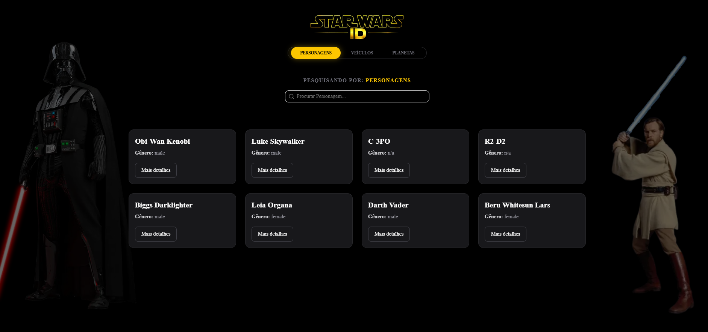

# StarWars Find

Buscador interativo e catálogo detalhado de informações do universo Star Wars (Personagens, Veículos e Planetas).

A aplicação integra dados da SWAPI (The Star Wars API), apresentando as características biológicas, técnicas e planetárias em uma interface web com estética imersiva (Sci-Fi), otimizada para desempenho e experiência do usuário.

---

## Preview



---

## Visão Geral

O **StarWars Find** é uma aplicação web focada na exploração interativa do catálogo da franquia Star Wars.

A solução realiza a integração de dados da API pública SWAPI, consolidando-os em uma interface responsiva e de alta performance. O projeto foi arquitetado com ênfase em **Server-Side Rendering (SSR)**, gerenciamento de estado via URL (Search Params), manutenibilidade de código e qualidade de experiência do usuário.

A aplicação foi desenvolvida utilizando **Next.js 15** com a arquitetura moderna baseada no **App Router**.

---

## Stack Tecnológico

### Frontend e Arquitetura

* Framework: Next.js (App Router)
* Biblioteca: React 19
* Linguagem: TypeScript (tipagem estrita)

### Interface e Estilização

* Tailwind CSS
* Shadcn UI (componentes base: Dialog, Menubar, Button, Input)
* Lucide React (biblioteca de ícones)
* Estética de Dark Mode fixo (Temática Sci-Fi)

### Integração de Dados

* SWAPI (The Star Wars API) — catálogo de entidades e pesquisa

---

## Arquitetura de Software e Decisões Técnicas

A estrutura do projeto foi projetada utilizando os paradigmas modernos do **Next.js App Router**, com foco em modularidade, escalabilidade e organização da lógica de dados.

---

### Design Modular

A interface foi dividida em componentes com responsabilidade única, incluindo:

* `MainContainer` — orquestração de requisições de servidor e layout principal
* `CharacterCard` — componente polimórfico para exibição de Personagens, Veículos ou Planetas
* `SearchInput` — barra de pesquisa debounced integrada à URL
* `NavBar` — navegação e controle de categorias

Essa abordagem mantém o roteamento principal responsável apenas pela injeção das *Promises* dos parâmetros de busca (`searchParams`).

---

### Dictionary Pattern (Mapeamento Otimizado)

A API do Star Wars retorna filmes e planetas como URLs (ex: `https://swapi.dev/api/films/1/`), exigindo requisições adicionais para obter os nomes.

Para otimizar a performance, estruturas de mapeamento (`FILM_NAMES` e `PLANET_NAMES`) foram implementadas para traduzir IDs em nomes reais de forma instantânea:

* reduz complexidade de requisições em cascata
* facilita manutenção
* permite tradução de dados com custo computacional constante O(1)

---

### Imutabilidade de dados

A randomização inicial de personagens na página principal é realizada sem mutação do array original retornado pela API.

Exemplo:

```javascript
[...items].sort(() => 0.5 - Math.random())

```

Isso garante a segurança da estrutura de dados e evita efeitos colaterais.

---

### Tipagem estática rigorosa e Polimorfismo

Foram definidas interfaces específicas (`Character`, `Planet`, `Vehicle`) e um tipo unificado genérico (`SwapiItem`) para representar as respostas da API. Isso elimina o uso de tipagens flexíveis (`any`) e permite que um único componente de Card (e Dialog) se adapte inteligentemente para exibir "Modelos" de veículos, "Climas" de planetas ou "Gêneros" biológicos.

---

## Estratégias de Cache e Consumo de Dados

### Dados do Catálogo

As requisições à SWAPI utilizam o recurso de **fetch estendido do Next.js** com revalidação estática incremental (ISR):

```javascript
next: { revalidate: 3600 }

```

Isso permite que o servidor cacheie os resultados de buscas e categorias automaticamente por uma hora, reduzindo latência drástica e evitando bloqueios de *rate limit* na API externa.

---

## Interface e Experiência do Usuário

### Interface limpa e navegável (Dialogs)

A listagem principal (`Grid`) apresenta apenas dados vitais para evitar poluição visual. O detalhamento profundo (como altura, peso, população, lista completa de filmes) foi isolado em componentes modais assíncronos (`Dialog` do Shadcn).

---

### Sincronização de Estado na URL

O estado de busca e de categoria selecionada não fica retido no componente cliente. Ele é refletido na URL (`?category=vehicles&q=falcon`), permitindo o compartilhamento de links diretos de resultados de busca.

---

### Renderização progressiva com Suspense

A aplicação utiliza **React Suspense** de duas maneiras fundamentais:

* **Skeletons de Carregamento:** Através do `loading.tsx`, melhorando o *First Contentful Paint (FCP)*.
* **CSR Bailout Protection:** Componentes clientes que leem a URL (`NavBar` e `SearchInput`) são envelopados em `<Suspense>` para garantir um processo de *Build* estático bem-sucedido no Next.js.

---

## Acessibilidade, Localização e Resiliência

### Localização de dados e Capitalização

Dados vindos originalmente em inglês minúsculo são traduzidos visualmente (ex: "homeworld" vira "Planeta Natal") e estilizados com classes do Tailwind (`capitalize`) para leitura semântica correta em português.

---

### Tratamento de falhas e Empty States

Requisições externas são protegidas por blocos `try/catch` nos serviços de busca.

* Se a API falhar, uma mensagem estruturada de erro é exibida.
* Se a busca não retornar dados, um componente de estado vazio contextualizado (ex: *"Veículo não encontrado"*) assume a tela orientando o usuário.

---

## Estrutura do Projeto

```text
src
├ app
│  ├ layout.tsx
│  ├ loading.tsx
│  └ page.tsx
│
├ components
│  ├ ui (shadcn)
│  │  └ button, dialog, input, menubar...
│  ├ CharacterCard.tsx
│  ├ MainContainer.tsx
│  ├ NavBar.tsx
│  └ SearchInput.tsx
│
├ constants
│  └ swapi.ts
│
├ lib
│  └ utils.ts
│
├ services
│  └ swapi.ts
│
└ types
   └ swapi.ts

```

---

## Instalação e Execução

### Pré-requisitos

* Node.js 18 ou superior

*(Nota: O projeto utiliza a SWAPI, que é pública e gratuita, não exigindo configurações de chaves de API).*

---

### Clone do repositório

```bash
git clone https://github.com/SEU_USUARIO/starwars-find.git
cd starwars-find

```

---

### Instalação de dependências

```bash
npm install
# ou
pnpm install
# ou
yarn install

```

---

### Execução do projeto (Desenvolvimento)

```bash
npm run dev

```

A aplicação estará disponível em:

```text
http://localhost:3000

```

---

### Build para Produção

```bash
npm run build
npm start

```